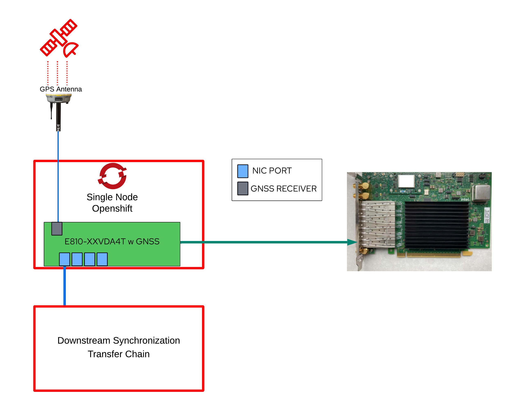

== Test Setup

We provide the description of the system under test used for providing test
results and analysis for Telecom Grandmaster (T-GM).
The system under test consists of a Single Node OpenShift (SNO) cluster equipped
with a single Intel WestPort Channel (https://cdrdv2.intel.com/v1/dl/getContent/641626[E810-XXVDA4T]) with GNSS receiver option.
As for the SNO cluster, note that:

* it is installed on one bare-metal host using Zero Touch Provisioning (ZTP). In
particular the results reported consider a fresh SNO cluster installed with the
PTP operator installed and configured for T-GM functionality.

* it does not consider any additional workloads installed in the cluster, which are out of the scope of this test report.

* the baremetal node requires a PCI-Express 4.0 slot to install the E810-XXVDA4T  with GNSS receiver.

As for the E810-XXVDA4T with GNSS:

* the GNSS receiver gets its time reference from a GPS antennna providing
a time signal traceable to a recognized time standard (such as coordinated
universal time, UTC). These time signals come from navigation satellite constellations such as GPS.

* a GPS antenna requires clear sight of the sky connected to the GNSS receiver
of the WPC card.

* with respect to the NIC connections, only one NIC port out of the four
available ports is used as T-GM port for the
evaluation. The port connects to downstream nodes in the synchronization transfer chain.

Finally it is important to note that the setup described above does not make any assumption on the topology formed by the downstream nodes in the synchronization transfer chain, which are out of the scope of
this report.  Specifics of the Hardware and Software versions are detailed in next sections of the report.

